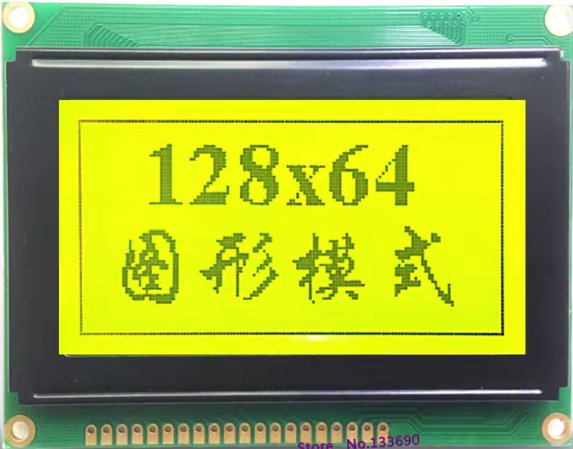
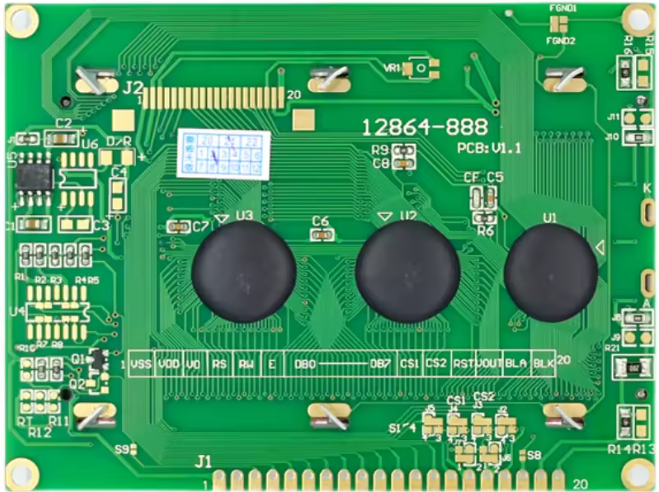
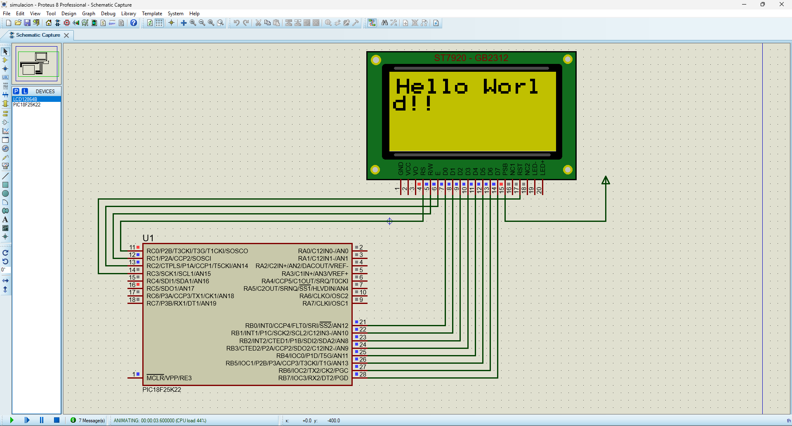

# GDM128645K GLCD Library for PIC18F25K22 (ST7920 Controller)

 

A lightweight and educational graphics library for the GDM12864-5K graphical LCD, powered by the ST7920 controller. Designed for bare-metal programming on the PIC18F25K22 using CCS C, with full support for Proteus simulation.

---

## Features

- Pixel-level control (set, clear, toggle)
- Text rendering (custom font support)
- Graphics primitives: lines, rectangles, circles
- Full-screen buffer management
- Direct register manipulation (no abstraction layers)
- Compatible with Proteus for simulation and validation

---

## About the Controller: ST7920

The ST7920 is a versatile controller for 128x64 GLCDs. It supports both serial and parallel interfaces, and is widely used in embedded systems. This library uses the **serial mode** for reduced pin usage and faster updates.

### Key ST7920 Features:
- 128x64 pixel resolution
- Built-in CGROM for ASCII characters
- Supports custom graphics via RAM access
- SPI-like serial interface (3-wire)

---

## Hardware Requirements

| Component           | Description                          |
|--------------------|--------------------------------------|
| Microcontroller     | PIC18F25K22                          |
| Display             | GDM12864-5K (ST7920 controller)      |
| Compiler            | CCS C                                |
| Simulation          | Proteus (optional, included)         |
| Power Supply        | 5V regulated                         |

---

## Proteus Simulation

This project includes a ready-to-use Proteus `.DSN` file for testing the GLCD interface with the PIC18F25K22. It demonstrates:

- Initialization sequence
- Pixel plotting
- Text rendering
- Real-time updates

---
# PIN conections
1  GND (0V)  =
2  VSS (+5V)=
3  VO  Power Supply for LCD Drive ** = resistor de 4.7k entre vo y vr   vo o-/\/\/\/-o vr
4  RS/CS 23 (D/I)RB2 PIN 35 Register selection for parallel mode/Chip enable for serial mode -
5  RW /SID   Read write selection for parallel mode/Serial data for serial mode-
6  E/SCL   24  Enable signal for parallel mode/Serial clock -       
7  DB0 . GND
8  DB1 . GND
9  DB2 . GND
10 DB3 . GND
11 DB4 . DATO4
12 DB5 . DATO5
13 DB6 . DATO6
14 DB7 . DATO7
15 PSB Parallel mode/Serial modei     COLOCAR A V+ 5V DC
16 NC     
17 /RST     
18 VR  Power supply for LCD drive   vo o-/\/\/\/-o vr
19 Power Supply for Backlight(+)
20 Power Supply for Backlight(-)

## File Structure
---

## Educational Focus

This library is part of a broader initiative to teach your self using PIC microcontrollers. It emphasizes:

- Register-level control
- Minimal dependencies
- Clear documentation
- Spanish/English technical clarity

---

## Keywords

`ST7920`, `GDM128645K`, `GLCD`, `PIC18F25K22`, `CCS C`, `Proteus`, `Embedded Systems`, `Microcontroller Graphics`

---

## License

MIT License. Free to use, modify, and distribute with attribution.

---

## Credits

Developed by Mariano Rocha, educator and embedded systems enthusiast. Focused on empowering learners through clear, hands-on technical resources.

